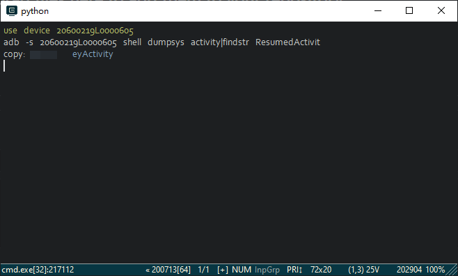
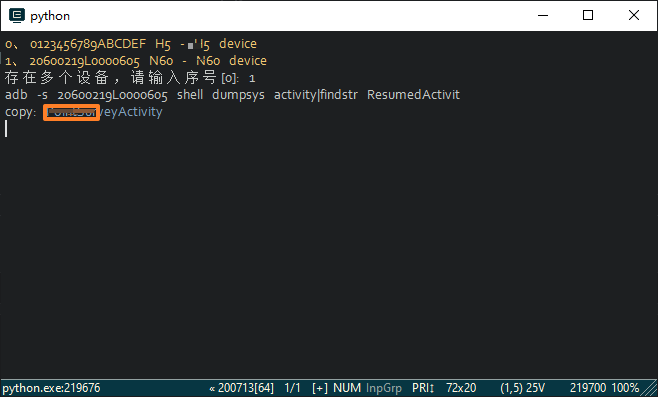
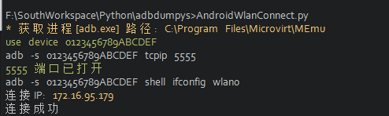

# AndroidDebugFindActivity
让你快速找到你得Android设备正在显示的界面对应的Activity
# AndroidWlanConnect 
一键adb无线连接移动设备

## 环境
+ python 3.+  我这里用的是python 3.6
+ 操作剪贴板的库，代码中主要用到 win32con和win32clipboard，具体安装的命令忘了~~

## 用法
1. 首先安装操作剪贴板的库，代码中主要用到 win32con和win32clipboard，具体安装的命令忘了~~
2. 连接上你的Android 设备到电脑
3. 双击本脚本运行

## 预览一下 
### AndroidDebugFindActivity
+ 单个设备  

+ 多个设备  

### AndroidWlanConnect 

## 原理
+ 调用adb命令 `adb devices -l` 获取设备列表、裁剪
+ 调用adb命令 `adb -s {} shell dumpsys activity|findstr ResumedActivit` 获取顶部Activity 名称
+ 调用剪切板操作库 把Activity名称 复制到粘贴板

## 快捷用法--创建快捷方式 固定到任务栏
1. 准备好上述操作后，在资源管理器空白处右键
2. 新建-->快捷方式
3. 在对象位置输入框中输入python 脚本所在全路径名（如果没有配置python环境变量 需要输入python的全路径）
4. 下一步 输入名称-->完成
5. 把创建的快捷方式上拖拽到任务栏即可
